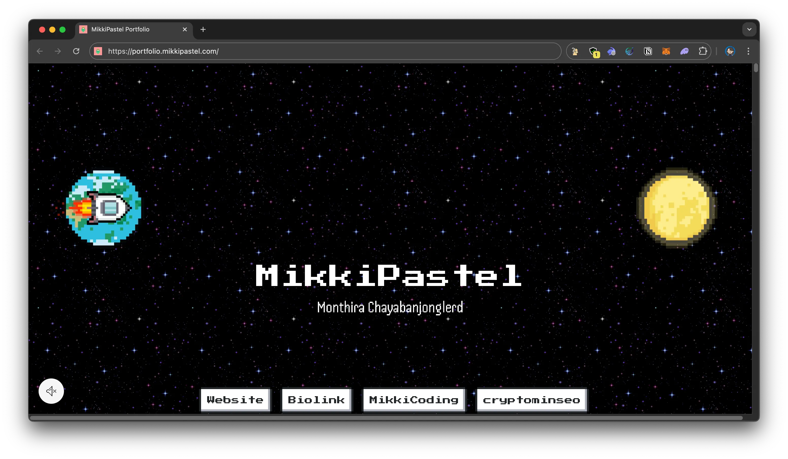

# MikkiPastel Portfolio Website

This is my portfolio website
https://portfolio.mikkipastel.com



### Made by :
- HTML + CSS + JavaScript
- Firebase Hosting
- static website with call dynamic data from API with Ghost CMS and Firebase Cloud Function
- PWA support
- LOVE pixel art

more about this https://www.mikkipastel.com/new-portfolio-website/

### What's content in my portfolio website?
- About me
- Lasted Blog
- Publish Application
- Android Project (Archive)
- Web Application / Chatbot
- Experience Timeline
- Work Experience

## Deploy

- install all library
```
npm install
```

- install Firebase CIL
```
npm install -g firebase-tools
```

### Firebase Cloud Function
- go to functions folder
```
cd functions
```

- deploy all
```
npm run deploy
```

- deploy only function
```
firebase deploy --only functions:FUNCTION_NAME
```

### Firebase Hosting
- go to public folder
```
cd public
```

- deploy preview
```
firebase hosting:channel:deploy CHANNEL_ID
```

- deploy public
```
firebase deploy --only hosting
```

- deploy to live channel by clone preview
```
firebase hosting:clone PROJECT_ID:CHANNEL_ID PROJECT_ID:live
```